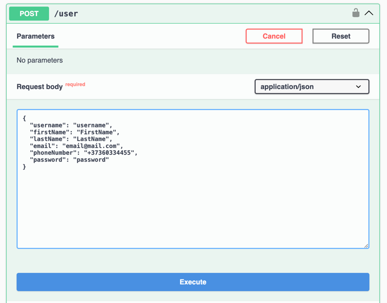
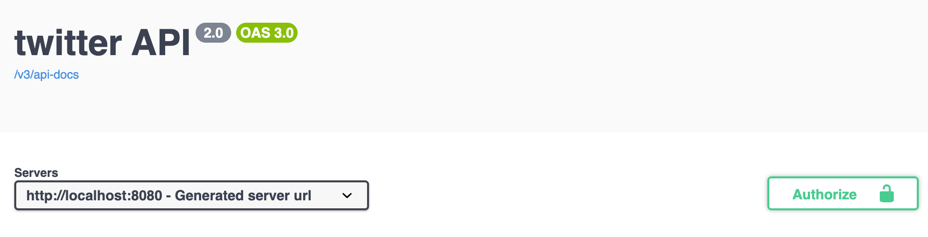
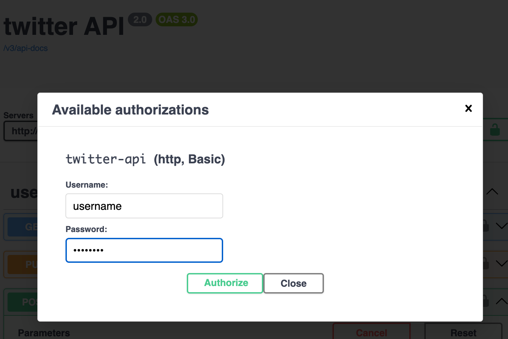
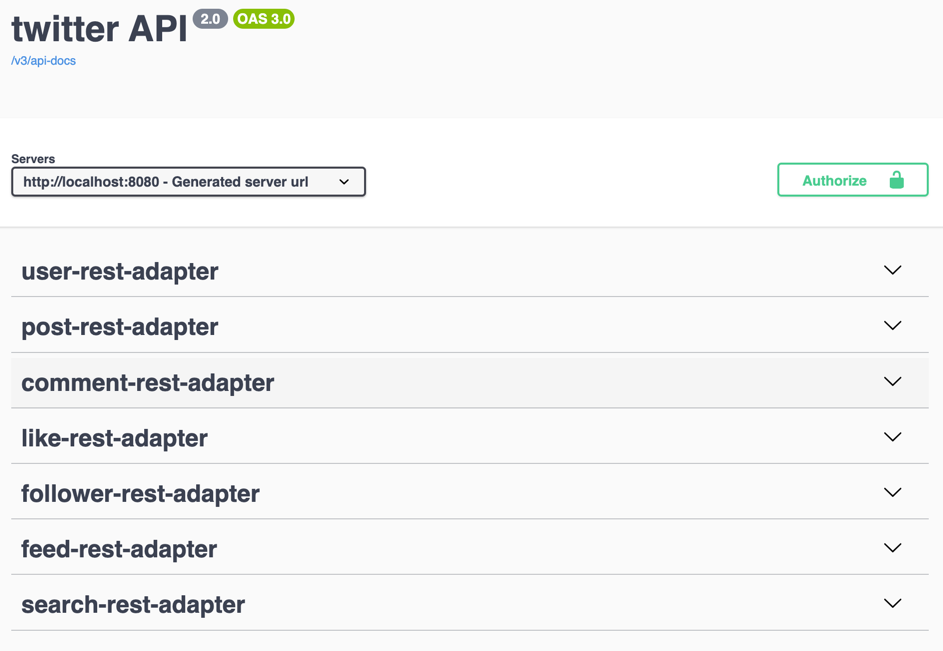

# Twitter API DOCUMENTATION

You can use API endpoints only if already are registered and authorized

# Swagger link: 
http://localhost:8080/swagger-ui/index.html

# Create User 
 User is created without authorization with this endpoint:  

# Authorization for Swagger

For authorization click Authorize Button

Then introduce username and password

Then click Authorize Button

# Now if DB exist User with authorize username and password then you can use all endpoints from twitter API

