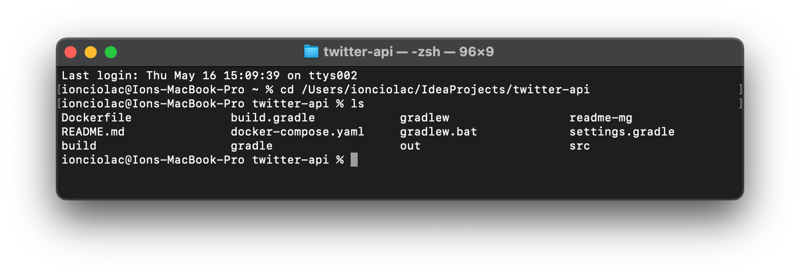
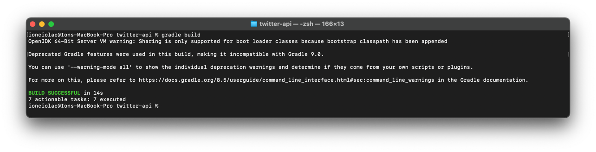
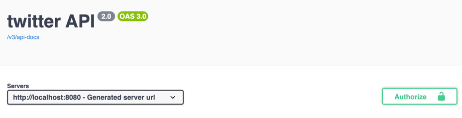
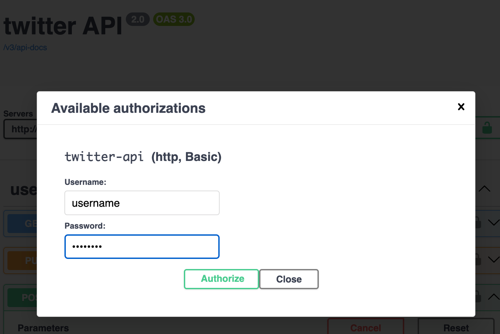
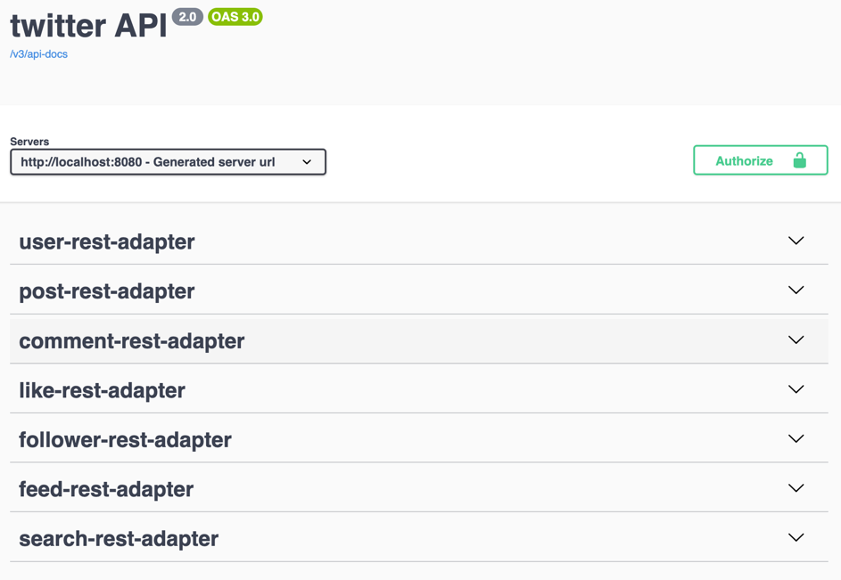

# How to start up app - Very important make sure you have installed **gradle** and **docker** where you will start the application

> clone on your machine project and open in terminal project

> run command: **gradle build**

> run command to create and start container twitter-api: **docker compose up**

> run command to stop and remove container twitter-api: **docker compose down**

> if container started then go to next step

# Twitter API DOCUMENTATION

> Swagger link: http://localhost:8080/swagger-ui/index.html

> You can use API endpoints only if already are registered and authorized. At the moment for authorization is used **Basic Authorization** 

# Create User 
> User is created without authorization with this endpoint:  

# Authorization for Swagger

> For authorization click Authorize Button

> Then introduce username and password

Then click Authorize Button

# Now if in DB exist User with authorize username and password then you can use all endpoints from twitter API
